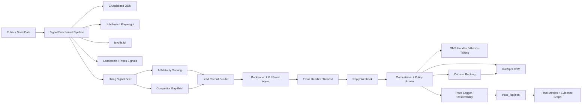

# Conversion Engine

Submission-focused Week 10 repo for the Tenacious Conversion Engine challenge. This repo supports the Act I / Act II vertical slice with seed-backed enrichment, outbound email, SMS warm-lead follow-up, HubSpot CRM writes, Cal.com booking scaffolding, and structured trace artifacts.

## Owner

- Amare Kassa — architecture, enrichment pipeline, orchestration, integration wiring, evaluation packaging

## Architecture diagram



## Directory index

- agent/ — orchestration, policies, reply handling.
- enrichment/ — Crunchbase, jobs, layoffs, AI maturity, competitor gap.
- integrations/ — Resend, Africa's Talking, HubSpot, Cal.com, tracing.
- app/ — FastAPI entrypoint and webhook handlers.
- probes/ — failure taxonomy, probe library, and target failure mode.
- scripts/ — enrichment refresh, evaluation, and metrics computation.
- data/ — raw and processed enrichment artifacts.
- seed/ — ICP, style guide, pricing, and supporting materials.
- metrics/ — computed evaluation outputs.
- eval/ — baseline and TRP evaluation artifacts.
- docs/ — supporting documentation and diagrams.

## What is in place

- Tutor-provided Act I baseline artifacts:
  - `baseline.md`
  - `eval/score_log.json`
  - `eval/trace_log.jsonl`
- Act II orchestration:
  - email-first outreach
  - reply classification
  - SMS warm-lead follow-up
  - HubSpot contact/company writes
  - Cal.com booking interface
  - conversation-state persistence
  - trace logging
- Signal enrichment pipeline:
  - Crunchbase / firmographic data
  - layoffs.fyi signal parsing
  - Playwright public job-post collector
  - public press / leadership-signal collector
  - merged processed artifacts with per-signal confidence scores
- Processed outputs:
  - `data/processed/enrichment/<company_slug>/`
  - `data/processed/leads/<company_slug>.json`
- Seed materials:
  - `seed/bench_summary.json`
  - `seed/style_guide.md`
  - `seed/pricing_sheet.md`
  - `seed/icp_definition.md`
  - `seed/email_sequences/`
  - `seed/discovery_transcripts/`
  - `seed/schemas/`

---

## Week 11 — Tenacious-Bench v0.1

### Overview

Tenacious-Bench v0.1 is a domain-specific benchmark for evaluating outbound sales messaging quality for Tenacious. It replaces reliance on τ²-Bench by focusing on grounded, honest, and production-safe communication.

---

### How to Run the Evaluator

```bash
uv run python week11/scoring_evaluator.py \
week11/tenacious_bench_v0.1/examples/task_001.json

```

### Run full calibration:

```bash
uv run python week11/scoring_evaluator.py week11/tenacious_bench_v0.1/examples/task_001.json
uv run python week11/scoring_evaluator.py week11/tenacious_bench_v0.1/examples/task_002.json
uv run python week11/scoring_evaluator.py week11/tenacious_bench_v0.1/examples/task_003.json
```

### Current Status (Interim)

- 20 trace-derived seed tasks generated from `data/trace_log.jsonl`
- 3 calibration tasks (good, banned-phrase, adversarial)
- Dataset partitioned into:
  - train
  - dev
  - held_out
- Rule-based evaluator implemented with:
  - banned phrase detection
  - grounding checks
  - CTA checks
  - capacity validation
  - internal-analysis leakage detection
- Hard-failure scoring caps implemented

### Interim Deliverables (Acts I–II)
- audit_memo.md
- schema.json
- scoring_evaluator.py
- tenacious_bench_v0.1/ (dataset partitions)
- datasheet.md
- methodology.md
- inter_rater_agreement.md
- worked_examples.md
- bench_composition.md
- contamination_check.json
- generation_scripts/
- synthesis_memos/

### Next Steps (Days 4–7)
- Generate preference pairs (chosen vs rejected outputs)
- Train a preference-tuned judge (Path B)
- Run ablations on held-out dataset
- Report Delta A / Delta B
- Publish dataset (HuggingFace)
- Produce memo, blog post, and demo video

### Quick Eval (one command)

```bash
uv run python week11/scoring_evaluator.py \
week11/tenacious_bench_v0.1/examples/task_001.json
```


### 2) Scoring scale (clarity)

```md
Scores are out of 8 and include hard-failure caps for policy violations.
```

### Reproducibility

Clone the repo, run the evaluator on provided tasks, and verify scores match expected outputs within tolerance.

---

## Quick start with uv

```bash
uv sync
uv run playwright install chromium

uv run python scripts/audit_data_sources.py
uv run python scripts/fetch_job_posts_playwright.py
uv run python scripts/fetch_leadership_signals.py
uv run python scripts/refresh_enrichment.py

uv run python -m agent.orchestrator --company Ramp --recipient amaremek@gmail.com
uv run python -m agent.orchestrator --company Ramp --recipient amaremek@gmail.com --reply "Yes, let's talk next week" --book
uv run python scripts/compute_final_metrics.py
```

## Test FastAPI webhooks

### Run server
uvicorn app.main:app --reload

### Test email webhook:
curl -X POST http://localhost:8000/webhooks/email/inbound \
  -H "Content-Type: application/json" \
  -d '{
    "from": "amaremek@gmail.com",
    "text": "Yes, interested",
    "metadata": {
      "company_name": "Ramp"
    }
  }'

### Test SMS webhook

  curl -X POST http://localhost:8000/webhooks/africastalking/sms \
  -d "from=+1234567890&text=Interested"

## Channel hierarchy and safety defaults

This repo is email-first. SMS is only a warm-lead scheduling fallback after a synthetic prospect has replied by email. Voice is not required for the core submission and is treated as the final human discovery-call channel.

Outbound content that uses Tenacious positioning is marked as `draft: true` in message metadata. The repo should run against synthetic prospects only unless `LIVE_OUTBOUND_ENABLED=true` is explicitly set. When this flag is unset, production deployments should route outbound to the staff sink or stub providers.

After a successful Cal.com booking, `agent/orchestrator.py` immediately calls `log_booking_update()` in `integrations/hubspot.py`, attaching the booking time, booking ID, booking URL, and `booking_completed=true` to the same HubSpot contact/company record.

## Final-submission metrics

Run `uv run python scripts/compute_final_metrics.py` to calculate and write:

- `metrics/final_metrics.json`
- `evidence_graph.json`

The script computes competitive-gap outbound share, gap-vs-generic reply-rate delta, stalled-thread rate, cost per qualified lead, and p50/p95 latency from trace files. If TRP-provided benchmark traces are present under `eval/trp1-eval/`, they are also summarized without overwriting the organization-run artifacts.

## Act IV status

Act IV starter implementation added: see `method.md`, `ablation_results.json`, `held_out_traces.jsonl`, `evidence_graph_act4.json`, and `eval/act4/run_act4_eval.py`. The local deterministic held-out harness reports Delta A positive with p < 0.05; replace the local held-out probe slice with the official sealed slice when available.
